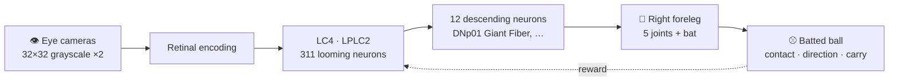

<div align="center">

# FlyOhtani 🪰⚾

**A life-sized fruit fly steps into the batter's box, watches the pitch with its own eyes, and swings.**

A research simulation built from a NeuroMechFly body, a MaleCNS connectome circuit, and MuJoCo physics.


[한국어](README.md) · English


<sub><b>A hit the learned circuit decided on by itself.</b> A pitcher fly throws from the rubber; the batter sees the ball with its own eye and commits at 27.1 ms — "now, high zone". Exit speed 808 mm/s, launch +10°, a fair ball worth about 14 m at human scale. Played 133× slower than real time.</sub>

</div>

---

## What this is trying to do

Stand a 3.7 mm fruit fly in the batter's box the way a human batter stands. When
the pitch comes, the fly sees it with the small eyes on either side of its head,
and a circuit lifted from a real fly brain connectome drives its foreleg to swing
the bat. It is rewarded for making contact, and for driving the ball farther into
the infield.

The end goal is to watch all of that **on one screen** — the swing, what the fly
saw, the structure of the circuit inside its brain, and the spikes.



The wiring (who sends how many synapses to whom) is real data. The neuron
dynamics and the learning rule are **assumptions we made**.

**The whole path runs.** The fly sees the ball only through its eye, the
circuit decides when and where to swing, and a search tunes that decision. On
30 pitches it has never seen, it beats the best policy that cannot see — on
all three seeds tried (see [results](#results-so-far)).

What is verified today and what does not exist yet is in
[STATUS](docs/records/STATUS.md) (Korean); the full plan and the design decisions
are in [PLAN](docs/PLAN.md) (Korean).

## A look around

### The fly at the plate


The park is built to real dimensions — foul lines, bases, mound, an outfield
fence (325 ft down the lines, 400 ft to centre, 12 ft high), stands, foul
poles and a backstop — and all of it is **scenery only**, with collisions off. The dark
section of the centre-field stands is the **batter's eye**, there for the
reason a real park has one: a white ball is lost against a bright sky
(measured: 7 of 9 frames against sky, 9 of 9 against the screen).

The body is held fixed and **only the right foreleg** moves, through its real
joints. Bat, home plate and the box are shrunk by a single factor (fly height
3.74 mm ÷ human height 1830 mm ≈ 1/490). The bat is a 1.76 mm solid of
revolution made from the profile of a real wooden bat. **The ball is the one
exception, at twice scale** (radius 0.151 mm): at true scale it is
[measurably invisible](docs/records/VM-01-EYE-RATE.md) to this eye. Its mass
is still scale-true, so it is a big, very light ball.


<sub>The 38 ms demo swing. Peak joint speed 287 rad/s, inside the 300 rad/s biological ceiling, and the fastest bat speed this arm reaches at the moment of contact (390 mm/s).</sub>

### What the fly sees


One 32×32 grayscale camera on each side of the head. The fly stands sideways,
so the left eye is the one facing the pitcher: it is **a 30° acute zone**
(0.94° per pixel) **aimed down the pitch**, while **the right eye keeps a 120°
wide field**. Each pixel integrates light over its own solid angle rather than
point-sampling, the way an ommatidium does. The first three frames are the
left eye taken from a real pitch: **at release, at the moment the swing must
start, and at 48 ms**. At the decision the ball is **a third of a pixel
across at 2–3.5% contrast** — about where a photoreceptor's limit is, and
about where a human batter reads a 93 mph fastball. It is still picked up in
all nine frames of the decision window, thanks to the acute zone and the dark
batter's eye behind it. The last frame is the right eye. The red ring is an
annotation — it is not part of the input the fly receives.

### The circuit in the brain


Our circuit lit up on top of 124,289 real somata (the blue points). In reading order
from the top left: LC4 → LPLC2 → descending neurons → all together. **Brightness is
synapse count, not neural activity.** No neuron is simulated yet.

### The viewer


A browser viewer that puts the recorded episode, the brain atlas and the fly body
on one screen. Built by modifying
[fly-connectome-template](https://github.com/cobanov/fly-connectome-template)
(see [below](#brain-visualization-viewer)).

## Results so far

| Check | Result |
| --- | --- |
| **G1** foreleg swing | All 240 runs stable. dt convergence 0.07%, spread across three integrators 0.02%. Actuation was never the bottleneck |
| **LIT-01** speed ceiling | Measured walking peak 98.6 rad/s; jump estimate 240–516 rad/s → design ceiling **300 rad/s** (bat tip up to 4.53 m/s) |
| **G4** connectome | LC4 (126) · LPLC2 (185) → 12 descending neurons, 1,343 connections. Known looming–escape pathways (LPLC2 → Giant Fiber, …) are present in the data |
| **G2** contact | v1 **FAILED** (contact lasted only 3–4 steps, so the restitution coefficient swung 0.33 ↔ 0.63) → v2 passed (restitution 0.42–0.46) |
| **VM-01** vision | A scale-true ball is **not visible**: 0.25° across against a 3.75° pixel. 180 + 576 + 256 combinations measured; the answer is a 2× ball and an aimed 30° eye. The eye's frame rate was never the bottleneck |
| Batter-scene contact check | K1–K6 all pass. Restitution 0.41–0.46, no energy created |
| **VM-01** pitch | A slow pitch is lofted by gravity (+21° launch). It takes a **Kershaw-class fastball** (93 mph Froude-scaled to 1888 mm/s) released 122 mm away to fly flat (+5.6°) |
| Brain circuit | Spikes run retina → LC4/LPLC2 → descending neurons. **Delay the pitch by 2 ms and the trigger moves by exactly one frame** — it reads the ball, not a clock |
| Learning | On 30 unseen pitches, **all three seeds beat the best blind baseline** (0.877 / 0.566 / 0.613 against 0.471). Contact rate 0.23–0.30 |
| Shuffled control | Shuffle the wiring and the score survives — **there is no evidence yet that the connectome's structure is what does the work** ([BRAIN-CIRCUIT](docs/records/BRAIN-CIRCUIT.md), Korean) |
| Recorded hit | The learned policy: 808 mm/s, launch +10°, carry 28.9 mm (about 14 m at human scale), fair |

Failed runs are kept, not deleted. Evidence files are in
[docs/records/evidence/](docs/records/evidence/); the run log is
[VALIDATION_LOG](docs/records/VALIDATION_LOG.md).

## Getting started

**You need:** Python 3.11+, and Node.js 22.18+ for the viewer. Developed on an
Apple M2 Pro laptop; no GPU required. A 0.1 s episode takes about 0.6 s.

```bash
git clone https://github.com/gitwub5/FlyOhtani.git && cd FlyOhtani
python3.11 -m venv .venv
.venv/bin/pip install -e ".[dev,video]"
.venv/bin/pytest                      # 139 passed
```

### Record an episode

```bash
.venv/bin/python -m flyohtani.record pitch --aim-z-mm 0.05 --out runs/record/hit       # a hit
.venv/bin/python -m flyohtani.record pitch --timing-ms -3 --out runs/record/miss-early # swinging early
.venv/bin/python -m flyohtani.record pitch --speed-scale 0.8 --out runs/record/slow    # a slower pitch
.venv/bin/python -m flyohtani.record swing --out runs/record/swing                     # the swing alone, no ball
```

Each writes `video.mp4`, a contact sheet `sheet.png` and the outcome
`manifest.json` into `runs/record/<name>/`.

### Running the learner

```bash
.venv/bin/python -m flyohtani.task.learn --reward carry-v1 \
    --generations 8 --population 10 --train-pitches 24 --seed 3 \
    --out runs/learn/my-run.json
```

It trains on `pitches.training_pitches`, reports on `evaluation_pitches`
(which nothing selects on), and scores every blind fixed-frame policy for
comparison into the same JSON. About 0.4 s an episode, 15–20 minutes at these
settings.

### Brain visualization viewer

```bash
.venv/bin/python -m flyohtani.brain.replay --run runs/record/hit   # export for the viewer
cd viewer && npm ci && npm run dev                                 # http://127.0.0.1:5173
```

Built with [fly-connectome-template](https://github.com/cobanov/fly-connectome-template) by [Mert Cobanov](https://github.com/cobanov).

`viewer/` is that template, modified, and is covered by the **Cobanov Template
Attribution License 1.0** ([viewer/LICENSE](viewer/LICENSE)). The credit above
must not be removed from this README or from the viewer's UI. What we changed is
listed in [viewer/MODIFICATIONS.md](viewer/MODIFICATIONS.md); provenance is in
[viewer/PROVENANCE.json](viewer/PROVENANCE.json).

## Repository layout

```
flyohtani/
├── units.py        unit convention (mm · g · μN), constants measured from the source model
├── body/           the real foreleg + bat model, the G1 sweep, speed limits
├── brain/          MaleCNS looming-circuit loader, export for the viewer
├── sense/          eye cameras, ball detection and tracking, observation schema
├── world/          the batter scene, contact parameters, G2 and the contact check
├── record/         episode → video · stills · outcome JSON
└── assets/         NeuroMechFly meshes/MJCF/walking data, the connectome subgraph (with provenance)
viewer/             3D brain viewer (based on fly-connectome-template)
tests/              139 pytest tests + a viewer parser test
docs/               plan, status, per-gate reports, evidence files (Korean)
```

## How this is run

- **Acceptance criteria are committed before the run.** Commit order serves as
  pre-registration. A bad result does not get the criteria loosened.
- **No single number is trusted until it has been shaken.** dt convergence,
  integrator cross-checks, sensitivity analysis.
- **Failures are not deleted.** The G2 v1 failure, voided runs, and claims that
  turned out to be wrong are all still in the records, with their corrections.
- **"We chose this" and "this is what came out" are kept apart** — engineering
  choices are never written up as measurements.

### What this repository does not claim

- Containing a connectome does **not** mean the brain is reproduced. This is real
  wiring + assumed neuron dynamics + assumed plasticity.
- The brain panel in the viewer shows **wiring**, not activity.
- The swing in the video is **scripted**, not learned.
- The ball is **twice scale**, the left eye is **six times finer** than a real
  fruit fly's, and the mound is **60 m away** in real terms. That is what it
  took to let the fly see a pitch and still swing at it; the bill is itemised
  in [VM-01](docs/records/VM-01-EYE-RATE.md).
- "Ohtani-class" here means the ceiling of **this body**, not a scaled human
  one: the bat reaches a quarter of a Froude-scaled Ohtani, and the 300 rad/s
  joint limit was left where the literature put it.
- Hand-written and RL controllers are environment baselines only. Any claim that
  the real circuit does better waits for shuffled-wiring and frozen-circuit
  controls.

## Documentation

The documents below are in Korean.

| Document | Contents |
| --- | --- |
| [PLAN](docs/PLAN.md) | Design decisions D01–D30, phases and gates |
| [STATUS](docs/records/STATUS.md) | What is verified now and what is blocked |
| [G1 foreleg swing](docs/records/G1-FORELEG-SWING.md) · [LIT-01 speed limits](docs/records/LIT-01-FLY-LEG-LIMITS.md) | Body |
| [G2 contact](docs/records/G2-CONTACT.md) · [batter scene](docs/records/BATTER-SCENE.md) | World |
| [VM-01 vision](docs/records/VM-01-EYE-RATE.md) | Can the ball be seen — three failures and the design rules they produced |
| [G4 connectome](docs/records/G4-CONNECTOME-ACCESS.md) | Brain |
| [Prior findings](docs/records/PRIOR-FINDINGS.md) | What the previous version settled, and the failures not to repeat |
| [Index](docs/README.md) | The full list |

## Data · licenses · citation

The project code is [MIT](LICENSE); `viewer/` follows the template license above.
Imported third-party assets keep their own licenses, with source, version and
checksums recorded in [THIRD_PARTY_NOTICES](THIRD_PARTY_NOTICES.md) and
[RESEARCH_SOURCES](docs/RESEARCH_SOURCES.md).

| Asset | Source | License |
| --- | --- | --- |
| Fly meshes · MJCF · walking joint angles | NeuroMechFly v2 / flygym 1.2.1 | Apache-2.0 |
| Looming-circuit wiring | MaleCNS v1.0 | CC-BY |
| Soma atlas · fly body inside the viewer | MaleCNS v1.0 · Flybody | CC BY 4.0 · Apache-2.0 |
| Brain viewer | fly-connectome-template (Mert Cobanov) | Cobanov Template Attribution License 1.0 |

This work stands on:

- Wang-Chen, S. et al. (2024). NeuroMechFly v2: simulating embodied sensorimotor control in adult *Drosophila*. *Nature Methods* 21, 2353–2362. [doi:10.1038/s41592-024-02497-y](https://doi.org/10.1038/s41592-024-02497-y)
- MaleCNS v1.0 connectome ([male-cns.janelia.org](https://male-cns.janelia.org/download/)) — FlyEM (HHMI Janelia), University of Cambridge, MRC LMB, Google Research. Terms of use are summarized in the [G4 report](docs/records/G4-CONNECTOME-ACCESS.md).
- Card, G. & Dickinson, M. (2008). Performance trade-offs in the flight initiation of *Drosophila*. *J. Exp. Biol.* 211, 341–353. [doi:10.1242/jeb.012682](https://doi.org/10.1242/jeb.012682)
- Zumstein, N. et al. (2004). Distance and force production during jumping in wild-type and mutant *Drosophila melanogaster*. *J. Exp. Biol.* 207, 3515–3522. [PMID 15339947](https://pubmed.ncbi.nlm.nih.gov/15339947/)

## Previous version

The whole of v1 — a human-sized field and a three-axis rigid bat — is preserved
in the git tag **`archive/human-scale-v0`**.
