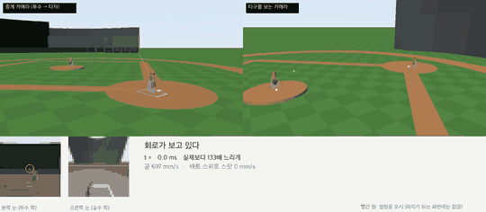
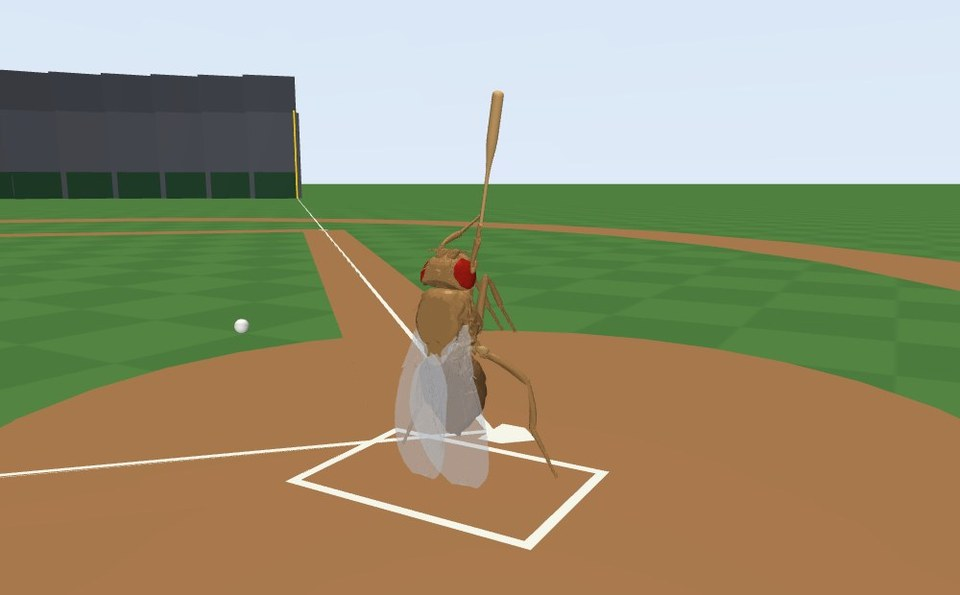
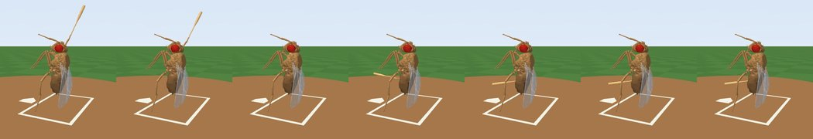
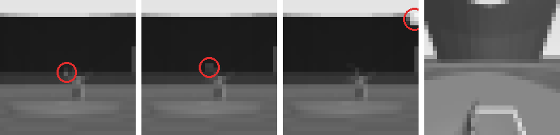
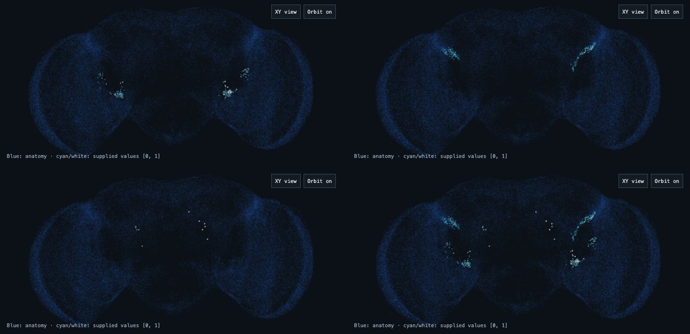
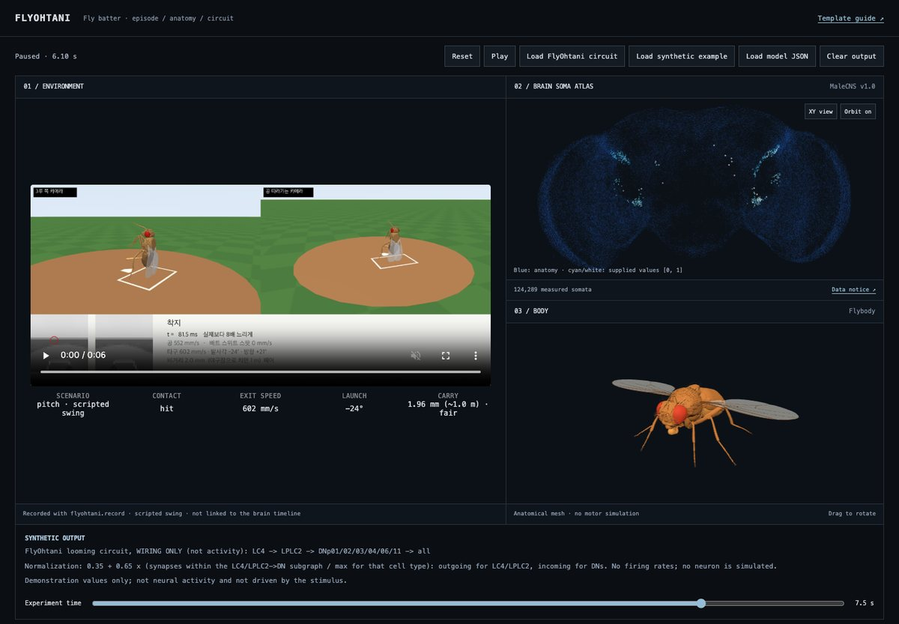

<div align="center">

# FlyOhtani 🪰⚾

**실제 크기의 초파리가 타석에 서서, 자기 눈으로 공을 보고, 배트를 휘두른다.**

NeuroMechFly 몸 · MaleCNS 커넥톰 회로 · MuJoCo 물리로 만드는 연구용 시뮬레이션


한국어 · [English](README.en.md)



<sub><b>학습된 회로가 스스로 판단해 친 타구.</b> 투수 파리가 투수판에서 던진 공을 눈으로 보고, 27.1 ms에 "지금, 높은 존"이라고 결정해 휘둘렀다 — 타구 808 mm/s, 발사각 +10°, 사람 크기로 환산하면 약 14 m 페어 타구. 실제보다 133배 느리게.</sub>

</div>

---

## 무엇을 하려는가

키 3.7 mm짜리 초파리를 사람 타자처럼 타석에 세운다. 공이 날아오면 파리는
머리 양옆의 작은 눈으로 그것을 보고, 실제 초파리 뇌 연결망에서 떼어 온 회로가
앞다리에 명령을 내려 배트를 휘두른다. 공을 맞히면, 그리고 내야 안으로 멀리
보낼수록 보상을 받는다.

최종 목표는 이 과정을 **한 화면에서 보는 것**이다 — 배트 스윙, 파리가 본 화면,
뇌 속 회로의 구조, 그리고 스파이크.


회로의 배선(누가 누구에게 시냅스를 몇 개 보내는지)은 실제 데이터다.
뉴런 동역학과 학습 규칙은 우리가 **가정한** 것이다.

**지금 이 경로가 끝까지 돈다.** 파리는 눈으로만 공을 보고, 회로가 언제·어디로
휘두를지 정하고, 학습이 그 결정을 조절한다. 처음 보는 투구 30개에서
**눈을 못 쓰는 최고 정책을 시드 3개 모두 이겼다**(아래 [결과](#결과)).

지금 무엇이 검증됐고 무엇이 아직 없는지는 [STATUS](docs/records/STATUS.md)에,
전체 계획과 설계 결정은 [PLAN](docs/PLAN.md)에 있다.

## 둘러보기

### 타석에 선 파리



구장은 실제 규격으로 세웠다 — 파울라인, 베이스, 마운드, 외야 펜스(라인 325 ft·
중앙 400 ft·높이 12 ft), 관중석, 파울폴, 백스톱. 전부 **시각 전용**이라 물리에는 개입하지
않는다. 중견 관중석의 어두운 구역은 **타자 배경막**으로, 실제 야구장과 같은
이유로 거기 있다 — 흰 공이 하늘에 묻히지 않게(측정: 하늘 배경 7/9 → 배경막 9/9).

**마운드 위에는 투수 파리**가 서 있다(시각 전용 — 공은 투구 기하가 발사한다).
공은 실제 투수판 위치에서 날아온다.

파리 몸은 고정하고 **오른쪽 앞다리만** 실제 관절로 움직인다. 배트·홈플레이트·
타석은 한 축척(파리 키 3.74 mm ÷ 사람 키 1830 mm ≈ 1/490)으로 줄였다.
배트는 실제 나무 배트의 단면을 회전시켜 만든 길이 1.76 mm짜리다.
**공만 예외로 축척의 2배**(반지름 0.151 mm)다 — 축척 그대로면 파리 눈에
[보이지 않는다는 것을 측정](docs/records/VM-01-EYE-RATE.md)했기 때문이다.
질량은 축척 그대로라, 크고 아주 가벼운 공이다.



<sub>40 ms 데모 스윙. 접촉 순간 배트가 <b>앞·위(+7~+11.5°)</b>로 512~526 mm/s로 지나간다 — 준비 자세를 겉모습이 아니라 <b>접촉 순간의 속도</b>로 찾은 결과다. 관절 최고 283~285 rad/s로 생물학적 상한(300) 안.</sub>

### 파리가 보는 화면



머리 양옆에 32×32 흑백 카메라가 하나씩 있다. 파리가 옆으로 서 있어 투수를
보는 **왼쪽 눈은 시야 20°의 예민한 영역**(0.63°/픽셀)으로 투구선을 겨누고,
**오른쪽 눈은 시야 120°**로 주변을 본다. 픽셀은 점이 아니라 **넓이로 빛을
적분**한다(낱눈의 수광각).

왼쪽 세 장은 실제 투구에서 뽑은 것이다 — **릴리스 순간, 스윙을 시작해야 하는
순간, 그리고 48 ms.** 결정 시점의 공은 **픽셀의 3분의 1 크기에 대비 2~3.5%**로,
광수용체 한계선에 있다(실제 타자가 시속 150 km를 보는 것도 이 수준이다).
그래도 결정 창 9프레임 전부에서 검출된다 — 예민한 눈과 어두운 타자 배경막
덕이다. 마지막 장은 오른쪽 눈. 빨간 원은 설명용이고 파리가 받는 입력에는 없다.

### 뇌 속 회로



실제 뇌 세포체 124,289개(파란 점) 위에 우리 회로를 켠 모습. 왼쪽 위부터
LC4 → LPLC2 → 하강 뉴런 → 전체. **밝기는 시냅스 수이지 신경 활동이 아니다.**
아직 어떤 뉴런도 시뮬레이션하지 않는다.

### 뷰어



녹화한 에피소드, 뇌 지도, 파리 몸을 한 화면에 띄우는 브라우저 뷰어.
[fly-connectome-template](https://github.com/cobanov/fly-connectome-template)을
가져와 수정했다([아래](#뇌-시각화-뷰어) 참고).

## 결과

**파리가 눈으로 공을 보고, 언제·어디로 휘두를지 스스로 정해서 친다.** 학습한
정책이 **한 번도 학습에 쓰이지 않은 투구 30개**에서, 눈을 못 쓰고 정해진
프레임에 휘두르는 가장 좋은 정책을 **시드 3개 모두** 이겼다.

| | 평가 보상 | 접촉 | 페어 |
| --- | --- | --- | --- |
| **학습한 회로** (시드 3·4·5) | **0.877 · 0.566 · 0.613** | 0.30 · 0.30 · 0.23 | 0.23 · 0.10 · 0.20 |
| 눈을 못 쓰는 최고 정책 | 0.471 | 0.20 | 0.13 |

정말 눈을 쓰는지는 따로 확인했다 — **투구를 2 ms 늦추면 트리거도 정확히
1프레임(2.08 ms) 늦어진다.** 시계를 세고 있었다면 그대로였을 것이다. 맨 위
영상의 타구는 808 mm/s, 발사각 +10°, 비거리 28.9 mm(사람 환산 약 14 m)다.

> ⚠️ **배선을 무작위로 섞은 대조군도 같은 성적을 낸다** — 셋 중 하나는 완전히
> 동일했다. 그래서 이 성적을 **연결망 구조 덕이라고 말할 수 없다.** 지금
> 디코딩이 "어느 하강뉴런이든 발화하면 스윙"이라 12개가 구분되지 않기
> 때문이고, 무엇을 해야 하는지는
> [BRAIN-CIRCUIT](docs/records/BRAIN-CIRCUIT.md)에 적어 뒀다.

<details>
<summary><b>여기까지 오면서 통과한 검증</b> — 몸 · 접촉 · 커넥톰 · 시각 (펼치기)</summary>

<br/>

| | 물은 것 | 결과 |
| --- | --- | --- |
| **G1** 몸 | 앞다리가 배트를 휘두를 수 있는가 | 240회 실행 전부 안정. dt 수렴 0.07%, 적분기 3종 편차 0.02%. 힘은 병목이 아니었다 |
| **LIT-01** 상한 | 관절을 얼마나 빨리 돌려도 되는가 | 실측 보행 최고 98.6 rad/s, 점프 추정 240~516 → 설계 상한 **300 rad/s** (배트 끝 4.53 m/s) |
| **G4** 커넥톰 | 루밍 회로를 실제로 받을 수 있는가 | LC4(126)·LPLC2(185) → 하강뉴런 12개, 연결 1,343개. LPLC2→Giant Fiber 등 문헌의 경로가 데이터에 그대로 있다 |
| **G2** 접촉 | 충돌을 믿을 수 있는가 | v1 **실패**(충돌이 3~4스텝뿐이라 반발계수가 0.33↔0.63으로 흔들림) → v2 통과(0.42~0.46). 타석 장면 확인 K1~K6도 통과 |
| **VM-01** 시각 | 파리가 공을 볼 수 있는가 | 축척 그대로면 **안 보인다**(각지름 0.25°, 픽셀은 3.75°). 1,000조합 넘게 재서 **공 2배 + 조준한 20° 눈**으로 성립. 눈 프레임률은 병목이 아니었다 |
| **D35** 투구 | 공이 실제 투수판에서 올 수 있는가 | 결정 시점 계산을 정정하니 **34.4 mm에서 52 ms**면 보고 휘두를 수 있다. 대가는 구속(커쇼 환산의 35%) |
| **D36** 스윙 | 배트가 공을 밀어치는가 | 기존 스윙은 접촉 때 **−18°로 내려가며** 공을 눌렀다. 준비 자세를 접촉 순간의 속도로 다시 찾아 **+7~+11.5°**로 바꾸자 비거리 0.3 → 66 mm |

실패한 실행도 지우지 않고 남긴다. 근거 파일은
[docs/records/evidence/](docs/records/evidence/), 실행한 명령과 그 결과는
[VALIDATION_LOG](docs/records/VALIDATION_LOG.md)에 있다.

</details>

## 시작하기

**필요한 것:** Python 3.11+, (뷰어를 쓸 때) Node.js 22.18+. Apple M2 Pro 노트북에서
개발했고 GPU는 필요 없다. 0.1초짜리 에피소드 하나를 약 0.4초에 돈다.

```bash
git clone https://github.com/gitwub5/FlyOhtani.git && cd FlyOhtani
python3.11 -m venv .venv
.venv/bin/pip install -e ".[dev,video]"
.venv/bin/pytest                      # 238 passed
```

### 에피소드 녹화

```bash
.venv/bin/python -m flyohtani.record pitch --aim-z-mm 0.05 --out runs/record/hit       # 안타
.venv/bin/python -m flyohtani.record pitch --timing-ms -3 --out runs/record/miss-early # 이른 스윙
.venv/bin/python -m flyohtani.record pitch --speed-scale 0.8 --out runs/record/slow    # 느린 공
.venv/bin/python -m flyohtani.record swing --out runs/record/swing                     # 공 없이 스윙만
```

`runs/record/<이름>/`에 `video.mp4`, 사진 모음 `sheet.png`, 결과 `manifest.json`이 생긴다.

### 학습 돌려보기

```bash
.venv/bin/python -m flyohtani.task.learn --reward carry-v1 \
    --generations 8 --population 10 --train-pitches 24 --seed 3 \
    --out runs/learn/my-run.json
```

훈련은 `pitches.training_pitches`, 평가는 **한 번도 학습에 쓰이지 않는**
`evaluation_pitches`로 하고, 눈을 못 쓰는 고정 프레임 정책 전부와 비교한 결과가
같은 JSON에 들어간다. 에피소드 하나에 약 0.4초, 위 설정으로 15~20분.

### 뇌 시각화 뷰어

```bash
.venv/bin/python -m flyohtani.brain.replay --run runs/record/hit   # 뷰어로 내보내기
cd viewer && npm ci && npm run dev                                 # http://127.0.0.1:5173
```

Built with [fly-connectome-template](https://github.com/cobanov/fly-connectome-template) by [Mert Cobanov](https://github.com/cobanov).

`viewer/`는 위 템플릿을 가져와 수정한 것으로, **Cobanov Template Attribution
License 1.0**([viewer/LICENSE](viewer/LICENSE))을 따른다. 위 표시는 이 README와
뷰어 화면에서 지우면 안 된다. 바꾼 내용은
[viewer/MODIFICATIONS.md](viewer/MODIFICATIONS.md), 출처는
[viewer/PROVENANCE.json](viewer/PROVENANCE.json)에 있다.

## 저장소 구조

```
flyshohei/          투수 — 구종 · 구속 · 릴리스 기하, 마운드 위 투수 파리
flyohtani/          타자
├── units.py        단위 규약 (mm · g · μN), 원본 모델 실측 상수
├── world/          타석 장면, 구장, 스윙·타구 물리, 빠른 에피소드, 자세 탐색
├── brain/          MaleCNS 루밍 회로, 망막 인코딩, LIF 회로, 뷰어 내보내기
├── task/           환경 API, 관측 계약, 보상, 투구 분포, 정책, 학습
├── record/         에피소드 → 영상 · 사진 · 결과 JSON
├── studies/        일회성 측정 (G1 · G2 · 타석 확인 · VM-01)
├── body/           실제 앞다리 + 배트 모델, G1 스윕, 속도 상한
├── sense/          v1의 고전 CV 파이프라인 (지금 경로는 쓰지 않는다)
└── assets/         NeuroMechFly 메시·MJCF·보행 데이터, 커넥톰 부분회로 (출처 포함)
viewer/             3D 뇌 뷰어 (fly-connectome-template 기반)
tests/              pytest 238개 + 뷰어 파서 테스트
docs/               계획, 상태, 게이트별 보고서, 근거 파일
```

## 연구 방식

- **수용 기준을 실행 전에 커밋한다.** 커밋 순서가 사전 등록 역할을 한다.
  결과가 나쁘다고 기준을 완화하지 않는다.
- **숫자 하나를 믿기 전에 흔들어 본다.** dt 수렴, 적분기 교차 검증, 민감도 분석.
- **실패를 지우지 않는다.** G2 v1 실패, 무효 처리한 실행, 틀렸던 주장과 그
  정정이 모두 기록에 남아 있다.
- **"이렇게 정했다"와 "이렇게 나왔다"를 구분한다.** 공학적 선택과 측정값을
  문서에서 섞지 않는다.

### 이 저장소가 주장하지 않는 것

- 연결망을 넣었다고 **실제 뇌를 재현했다고 주장하지 않는다.** 실제 배선 +
  가정한 뉴런 동역학 + 가정한 가소성이다.
- 뷰어의 뇌 화면은 **배선**이다. 활동이 아니다.
- 공은 축척보다 **2배 크고**, 왼쪽 눈은 실제 파리보다 **6배 예민**하며, 구속은
  커쇼 환산의 **35%**다. 셋 다 파리가 공을 보고 휘두를 수 있게 하려고 치른
  값이고, 무엇을 포기했는지는 [VM-01](docs/records/VM-01-EYE-RATE.md)에 있다.
- "오타니급"은 사람 오타니를 축척한 값이 아니라 **이 몸의 상한**이다. 배트 속도는
  오타니 환산치의 25%이고, 관절 상한 300 rad/s는 그대로 지켰다.
- **셔플 대조군을 아직 못 이겼다.** 배선을 무작위로 섞은 회로가 같은 성적을
  낸다(3개 중 1개가 완전히 동일). 지금 디코딩이 "어느 하강뉴런이든 발화하면
  스윙"이라 12개가 구분되지 않고, 타이밍은 사실상 망막이 정한다. 즉 지금 성적은
  **"연결망 덕분"이 아니라 "망막과 동시발화 계수기 덕분"**이다.
- 학습한 것은 **디코딩 상수 5개**다. 시냅스 가중치는 고정이고, 가소성은 아직 없다.

## 문서

| 문서 | 내용 |
| --- | --- |
| [PLAN](docs/PLAN.md) | 설계 결정 D01~D36, 단계와 게이트 |
| [STATUS](docs/records/STATUS.md) | 지금 검증된 것과 막혀 있는 것 |
| [G1 앞다리 스윙](docs/records/G1-FORELEG-SWING.md) · [LIT-01 속도 상한](docs/records/LIT-01-FLY-LEG-LIMITS.md) | 몸 |
| [G2 접촉](docs/records/G2-CONTACT.md) · [타석 장면](docs/records/BATTER-SCENE.md) | 세계 |
| [VM-01 시각](docs/records/VM-01-EYE-RATE.md) | 공이 보이는가 — 실패 세 번과 거기서 나온 설계 법칙 |
| [G4 커넥톰](docs/records/G4-CONNECTOME-ACCESS.md) · [뇌 회로](docs/records/BRAIN-CIRCUIT.md) | 뇌 — 배선을 받는 것과, 그것으로 회로를 도는 것 |
| [학습 01](docs/records/LEARNING-01.md) | 무엇을 학습했고 무엇을 기준선으로 삼았는가 |
| [선행 발견](docs/records/PRIOR-FINDINGS.md) | 이전 버전에서 확정된 사실과 반복하면 안 되는 실패 |
| [문서 색인](docs/README.md) | 전체 목록 |

## 데이터 · 라이선스 · 인용

프로젝트 코드는 [MIT](LICENSE). 단 `viewer/`는 위의 템플릿 라이선스를 따른다.
반입한 외부 자산은 각자의 라이선스를 따르며, 출처·버전·체크섬은
[THIRD_PARTY_NOTICES](THIRD_PARTY_NOTICES.md)와
[RESEARCH_SOURCES](docs/RESEARCH_SOURCES.md)에 있다.

| 자산 | 출처 | 라이선스 |
| --- | --- | --- |
| 초파리 메시·MJCF·보행 관절각 | NeuroMechFly v2 / flygym 1.2.1 | Apache-2.0 |
| 루밍 회로 배선 | MaleCNS v1.0 | CC-BY |
| 뷰어 속 뇌 세포체 지도 · 파리 몸 | MaleCNS v1.0 · Flybody | CC BY 4.0 · Apache-2.0 |
| 뇌 뷰어 | fly-connectome-template (Mert Cobanov) | Cobanov Template Attribution License 1.0 |

이 작업은 다음 연구에 기대고 있다.

- Wang-Chen, S. et al. (2024). NeuroMechFly v2: simulating embodied sensorimotor control in adult *Drosophila*. *Nature Methods* 21, 2353–2362. [doi:10.1038/s41592-024-02497-y](https://doi.org/10.1038/s41592-024-02497-y)
- MaleCNS v1.0 connectome ([male-cns.janelia.org](https://male-cns.janelia.org/download/)) — FlyEM (HHMI Janelia), University of Cambridge, MRC LMB, Google Research. 사용 조건은 [G4 보고서](docs/records/G4-CONNECTOME-ACCESS.md)에 정리했다.
- Card, G. & Dickinson, M. (2008). Performance trade-offs in the flight initiation of *Drosophila*. *J. Exp. Biol.* 211, 341–353. [doi:10.1242/jeb.012682](https://doi.org/10.1242/jeb.012682)
- Zumstein, N. et al. (2004). Distance and force production during jumping in wild-type and mutant *Drosophila melanogaster*. *J. Exp. Biol.* 207, 3515–3522. [PMID 15339947](https://pubmed.ncbi.nlm.nih.gov/15339947/)

## 이전 버전

사람 크기 구장 + 3축 강체 배트로 진행하던 v1 전체는 git 태그
**`archive/human-scale-v0`** 에 보존돼 있다.
