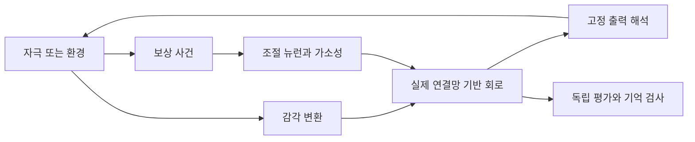

# FlyOhtani: 실제 회로의 새로운 과제 학습 연구 계획

2026-09-16 · 현재의 우선 계획. 이전 [PROJECT_PLAN.md](PROJECT_PLAN.md)는 초기 구현 로드맵으로 보존한다.

## 1. 확정된 방향과 제안

**사용자 확정:** 구현보다 계획 우선. 실제 초파리 신경회로가 새로운 과제를 배우는지 연구한다.

역할 분담: Codex와는 계획·구조·규약을 정리하고, 코드 구현·테스트는 사용자와 Claude가 진행한다. 세부 틀은 [구조 계약](../design/ARCHITECTURE.md), [설계 결정](../DECISIONS.md), [구현 인계](../implementation/WORK_PACKAGES.md)를 따른다.

**제안하는 연구 질문:** 실제 연결망을 기반으로 한 회로에 문헌 기반 국소 가소성을 부여하면 새로운 자극–결과 관계를 학습하고 유지할 수 있는가? 그 효과가 공 가로채기 같은 새로운 감각운동 과제까지 확장되는가?

계산 모델에서의 학습, 연결망의 기여, 살아 있는 초파리에 대한 설명력을 각각 구분한다. 전체 뇌 규모나 실제 몸의 도입 시점은 아직 확정하지 않았다.

## 2. 연구 순서

### 단계 A — 학습의 정의와 재현 대상 선택

첫 실험은 보상과 연결할 두 자극 A/B를 사용한다. A+보상, B+중립을 반복한 뒤 **보상과 학습을 끈 시험에서 A/B 반응 차이가 남는지** 평가한다. 자극의 보상 대응은 반복 실험 사이에서 뒤집어 선천적인 입력 편향을 통제한다.

출발 후보는 버섯체의 KC–MBON–DAN 회로다. KC는 감각 표현을 전달하는 Kenyon cell, MBON은 출력 뉴런, DAN은 도파민 뉴런이다. Handler 2019와 Huang 2024의 시간 의존 가소성·기억 모델을 먼저 비교하고, 재현할 한 프로토콜을 고른다. [시간 의존 학습 논문](https://pmc.ncbi.nlm.nih.gov/articles/PMC9012144/), [기억 모델 논문](https://pmc.ncbi.nlm.nih.gov/articles/PMC11525173/)

**완료 기준:** 재현 대상, 뉴런·구획, 자극 시점, 가소성 식·매개변수 출처, 예상 반응, 허용 오차를 1쪽 규약으로 고정. 일반적인 reward-modulated STDP를 초파리 학습 규칙의 기본값으로 확정하지 않는다.

### 단계 B — 실제 연결망과 동역학의 단독 검증

- FlyWire 또는 MaleCNS 중 재현 대상에 맞는 데이터를 하나 선택한다. 서로 다른 개체의 ID를 직접 혼합하지 않는다.
- 뉴런 ID·유형·구획, 시냅스 수, 흥분/억제 및 조절 신호 처리, 자르는 경계를 기록한다.
- 소형 회로를 추출하더라도 실제 ID와 연결을 보존한다. 잘라낸 외부 입력과 피드백 비율을 보고한다.
- 무입력·강입력·자극 종류별 반응, 시간 간격 민감도, 무발화·폭주를 검증한다.
- 문헌에서 측정된 값, 다른 회로에서 가져온 값, 편의상 정한 값을 구분한다.

**완료 기준:** 데이터 체크섬과 회로 목록, 기준 신경 반응, reset 및 시간 재현성 확보. 전뇌가 필수라면 같은 검증을 전체 그래프에 적용하고 계산 비용 파일럿을 먼저 수행한다.

### 단계 C — 연합학습과 기억

핵심 실험은 **내부 연결만 학습하고 외부 readout은 고정**한다. readout은 신경 반응을 측정하는 출력 해석기로, 시험 결과에 맞춰 재학습하지 않는다. 훈련 전후 자극별 MBON 반응과 사전 정의한 선호 점수를 측정한다.

| 조건 | 무엇을 구분하는가 |
| --- | --- |
| 실제 회로 + 가소성 | 핵심 실험 |
| 같은 회로 + 가소성 꺼짐 | 일시적 활동·입력 편향과 학습 구분 |
| 자극과 무관하게 섞은 보상 | 단순 보상 노출과 연합 구분 |
| 자극 없이 보상만 제공 | 비특이적 흥분 변화와 자극 기억 구분 |
| 흥분/억제·차수 등을 맞춘 재배선 회로 | 실제 연결 구조의 기여 |
| 내부 고정 + 외부 출력층만 학습 | 외부 학습기로 해결되는 부분 |

기억은 여러 방식으로 검증한다.

1. 훈련 직후 보상·가소성을 끈 시험.
2. 가중치는 보존하고 막전압·시냅스 전류·eligibility trace 등 단기 상태를 초기화한 시험.
3. 같은 초기 상태에서 학습 전 가중치를 복원한 시험.
4. 학습한 가중치를 새 실행에 이식한 시험.
5. 일정 지연 뒤의 유지, A/B 보상 관계를 뒤집은 재학습.

**완료 기준:** 개선이 고정/섞인 보상 조건보다 크고, 짧은 신경 활동이 사라진 뒤에도 유지되며, 학습 연결을 되돌리면 줄어든다는 증거. 무효 결과도 연구 결과로 기록한다. 이 조건을 충족하지 못하면 공 치기로 확대하기 전에 입력·학습 규칙·출력 연결을 진단한다.

### 단계 D — 새로운 시간 과제로 확장

첫 확장은 ‘신호 뒤 특정 시간창에 반응’ 또는 단순한 go/no-go로 제안한다. 물리 시뮬레이션 없이 학습과 시간 지연의 문제를 분리할 수 있다. 후각 회로에 인공 입력을 직접 넣는 조건은 그렇게 표시하고, 시각 학습이라는 이름을 붙이지 않는다.

**완료 기준:** 훈련과 분리한 자극·시간 지연에서 유지되는 개선. 출력층 고정, 내부 학습, 보상 지연의 기여를 분리. 시각으로 확장할 때는 시각 입력에서 선택한 학습 회로로 이어지는 경로를 별도로 확인한다.

### 단계 E — 공 가로채기

기존 MuJoCo 환경은 이 단계의 평가 장치로 유지한다. 학습 착수 전에 궤적·충돌·지표 문제를 해결하고 무동작·무작위·scripted로 검증한다. [현황 진단](../records/PROJECT_AUDIT_2026-09-16.md)

MLP/PPO와 작은 RNN은 과제의 학습 가능성과 비교 성능을 확인하는 baseline이다. 학습된 readout을 이용하는 SNN도 별도 조건으로 둔다. 핵심 내부 가소성 실험과 baseline을 섞어 ‘초파리 회로가 배웠다’고 결론 내리지 않는다.

**완료 기준:** 동일 정보·동일 학습 예산에서 복수 반복, 미경험 궤적, 가소성 대조군과 기억 제거 평가. 타격은 인공 과제이며 자연 행동 재현으로 해석하지 않는다.

### 단계 F — 전체 뇌·실제 몸

부분회로 밖의 피드백이 필요하다는 근거나 실제 다리 협응에 대한 질문이 생겼을 때 확대한다. 전뇌 자체가 사용자의 연구 대상이면 단계를 작은 회로에서 끝내지 않고, 독립적인 전뇌 재현·성능 측정 경로를 추가한다. NeuroMechFly의 몸은 소형 학습 검증의 필수 조건으로 두지 않는다.

## 3. 구조 개선안

현재 환경·제어기·인코더·분석 분리는 유지하고 다음 책임을 추가한다. 아래는 계획이며 새 구현 폴더를 만들지 않았다.

| 계층 | 책임 |
| --- | --- |
| `connectomes/` | 버전·체크섬·뉴런 ID·필터·경계·출처 |
| `circuits/` | 회로 동역학과 신경 상태. 물리환경 없이도 실행 |
| `plasticity/` | 어떤 연결이 언제 바뀌는지, 조절 신호·학습 trace |
| `experiments/` | 조건화·기억·재학습·개입·평가 실행 |
| 기존 `encoders/`, `controllers/`, `envs/` | 감각 입력·출력 해석·물리환경의 독립 교체 |
| `configs/` | 회로/학습/과제/평가 설정과 실제 적용값 |
| `runs/<id>/` | 지표·설정·난수·상태·가중치·소스/데이터 식별자 |
| `tests/` | 신경 수치·시간·reset·궤적·접촉·저장/복원 검사 |

공통 실행기는 `neural_dt`, `physics_dt`, `control_dt`, 감각 갱신 주기를 관리한다. 학습·평가·시각화의 시계를 분리하고, 신경계와 몸이 같은 경과 시간을 갖도록 한다. 현재 2 ms toy 설정을 논문 재현에 그대로 사용하지 않는다.

## 4. 실험 기록과 평가 규약

- 초기 오류 확인은 2개 시드, 본 실험은 5개 이상 독립 시드를 출발 예산으로 제안. 분산·효과 크기와 계산 비용을 보고 본 평가 전에 확정.
- 각 조건에 같은 자극 순서 또는 대응되는 무작위 순서를 사용. 환경, 신경 입력, 모델 초기화의 난수를 분리해 저장.
- 개발/검증/시험 자극을 분리하고 시험 중 가소성을 기본적으로 비활성화. 온라인 적응은 별도 실험.
- 신경 지표: 자극별 반응, 발화율, 구획별 가중치 변화, 기억 유지, 학습 전후 효과.
- 과제 지표: 타격률, 실제 접촉 시간 오차, 접촉점 상대 속도, 제어 비용. 보상과 평가 점수를 분리.
- 학습 시드별 결과와 paired 차이·불확실성을 보고. 에피소드 여러 개를 독립 학습 반복으로 취급하지 않음.
- checkpoint에 가중치뿐 아니라 단기 신경 상태, 학습 trace, 난수 상태를 구분해 저장. 기억 검사마다 보존·초기화 항목을 명시.
- 전뇌 기록은 선택한 뉴런·구획과 요약 통계를 기본으로 하고, 모든 스파이크의 상시 저장 비용은 따로 측정.

## 5. 실행환경 개선안

현재 셸은 macOS arm64 / Python 3.14.0이며 주요 패키지가 없다. **Python 3.11 또는 3.12를 호환성 조사 후보**로 두고 선택한 논문 구현과 라이브러리의 지원 범위를 확인한 뒤 하나를 고정한다. 설치 성공을 확인한 조합은 아직 없다.

1. 로컬의 전용 환경과 lockfile. core·RL·SNN 의존성을 분리하고 논문 재현 환경도 독립 관리.
2. 조건화·소형 회로는 CPU 기준부터 측정. 계산 시간과 모델 속 신경 시간을 구분.
3. 1초 신경 시뮬레이션 파일럿에서 데이터 읽기/컴파일/실행/기록 시간과 최대 메모리를 각각 측정.
4. 더 큰 실험이 필요하면 Linux/NVIDIA 환경을 선택. Eon의 CUDA 및 FlyGym Warp 경로가 Mac에서 그대로 동작한다고 가정하지 않음. [Eon 구현](https://github.com/eonsystemspbc/fly-brain), [FlyGym 설치](https://neuromechfly.org/installation/)
5. 화면 없는 수치 실험을 기본으로 하고 일부 결과만 렌더링. macOS와 Linux EGL 설정 분리.

140,000×140,000의 dense float32 행렬 하나는 약 78.4 GB이므로 전체 배선은 sparse 형식으로 다룬다. 이는 단순 저장량 계산이며 전체 메모리 견적이 아니다. 현재 장비의 메모리·사용 가능한 GPU·허용 예산이 확인되지 않았으므로 규모·시간·구매는 확정하지 않는다.

NeuroMechFly 도입 시 논문 재현용 구버전과 최신 FlyGym 2.x API를 구분한다. 최신 API는 Gymnasium 준수를 중단했으므로 기존 PPO와 연결하려면 adapter와 필요한 감각 기능을 확인해야 한다. [공식 migration](https://neuromechfly.org/migration/)

## 6. 다음 계획 작업의 산출물

**[첫 연합학습 실험 규약 EXP-001](../experiments/EXP-001-associative-learning.md)의 초안을 만들었다.** 다음 계획 작업에서 채울 항목은 다음과 같다.

- 재현할 논문과 데이터: FlyWire/MaleCNS, 버전, 회로 구획.
- 자극 A/B, 보상 뉴런, 입력과 보상의 시간 순서.
- 뉴런 모델, 학습할 연결, 가소성 식·근거·미측정 가정.
- 고정 출력 측정법과 학습·기억의 통과 기준.
- 대조군, 반복 수, 최대 실행 예산.

연구 우선순위는 확정됐다. **부분회로로 출발할지 전뇌가 필수인지, 사용 가능한 장비와 예산, 재현 논문 선택**은 아직 제안·검토 대상이다. 해당 선택에 의존하는 실험은 확정 후 진행한다. Claude는 독립적인 기반 기능과 기존 물리 결함 수정을 [구현 인계](../implementation/WORK_PACKAGES.md)에 따라 먼저 진행할 수 있다.
